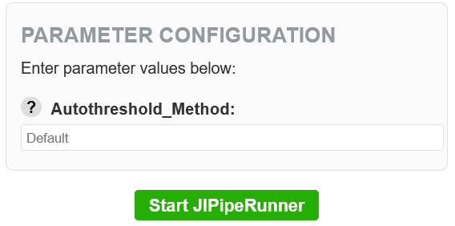

# JIPipeRunner documentation

JIPipeRunner is a plugin for [omero-web](https://github.com/ome/omero-web) that makes it possible to run [JIPipe](https://jipipe.hki-jena.de/) workflows directly on the server that is hosting the OMERO database. This eliminates the need for users to share their data and workflows outside of OMERO and greatly reduces the data traffic as well as aiding reproducibility.

## Requirements

- Python 3.10
- omero-web 5.28
- Django 4.2
- JIPipe 5.0 or later
- XVFB
- Celery 
- redis

## Installation

This section assumes that [omero-web](https://github.com/ome/omero-web) is already setup with redis caching and that JIPipe has been installed on the server via ImageJ as described by the [JIPipe documentation for manual installation](https://jipipe.hki-jena.de/documentation/manual-installation.html). If the plugin has trouble finding the ImageJ executable, double check if the application is installed to the server and that the environment variable **OMERODIR** is set as described in the [OMERO.web installation guide](https://docs.openmicroscopy.org/omero/5.6.0/sysadmins/unix/install-web/web-deployment.html). This is also important for the redis caching to work properly.

### Step 1

Within your [omero-web](https://github.com/ome/omero-web) virtual environment, install the plugin using [pip](https://pip.pypa.io/en/stable/):
```bash
pip install git+https://asb-git.hki-jena.de/MWank/OMERO_JIPipe_Plugin.git
```

### Step 2

Add "JIPipeRunner" to the list of installed apps using [omero-web](https://github.com/ome/omero-web):
```bash
omero config append omero.web.apps '"JIPipeRunner"'
```

### Step 3

Add the plugin to the right panel plugins using [omero-web](https://github.com/ome/omero-web):
```bash
omero config append omero.web.ui.right_plugins '["JIPipeRunner", "JIPipeRunner/right_plugin_example.js.html", "jipipe_form_container"]
```

### Step 4

Set the path to the ImageJ executable from the [manual installation of JIPipe](https://jipipe.hki-jena.de/documentation/manual-installation.html) using [omero-web](https://github.com/ome/omero-web):
```bash
omero config set omero.web.imagej "/path/to/ImageJ"
```

### Step 5

Restart [omero-web](https://github.com/ome/omero-web) for the changes to take effect:
```bash
omero web restart
```

Should there be any errors please regarding the webclient plugin installation refer to the official [OMERO WebclientPlugin documentation](https://docs.openmicroscopy.org/omero/5.6.3/developers/Web/WebclientPlugin.html).

### Step 6

Launch a Celery worker that will manage the jobs launched by the JIPipeRunner Celery app using:
```bash
celery -A JIPipePlugin worker --loglevel=info
```

The worker will use the redis cache as a backend that is defined in the OMERO settings, so be sure to have followed the [OMERO.web installation guide](https://docs.openmicroscopy.org/omero/5.6.0/sysadmins/unix/install-web/web-deployment.html) to include redis caching and define the OMERODIR environment variable correctly. JIPipeRunner will use your default cache backend location at:

```text
omero.web.caches = {
  "default": {
    "BACKEND": "django_redis.cache.RedisCache",
    "LOCATION": "redis://127.0.0.1:6379/0"
  }
}
```

## User guide

After the installation is completed, you can login to your OMERO server. If the installation was successful, you should see a tab called ***JIPipeRunner*** in the right panel. 

<p align="center">
  
</p>

After [getting started](#getting-started), check the remaining entries of the user guide to learn about the different sections within the plugin.

### Getting started

The plugin will load its content depending on the .jip file you select at the top of the configuration:

<p align="center">
  
</p>

JIPipeRunner will automatically offer you all .jip files as an option that are attached projects that you own or are a member of. To start using the plugin properly, you first need to have at least one .jip file attached to one of these projects. To do so, go to <b>General → Attachments</b> in the right panel of any of your projects. Click the <b>+</b> to attach a .jip file that adheres to the <a href="#pipeline-design-constraints">pipeline design constraints</a>. You can choose to upload a local file or use an already existing one on the server.

<p align="center">
  
</p>


### RUNNING JOBS

In this section you will find a list of all the JIPipe jobs currently running on the server that were initiated by the current user. By clicking the red ✖ next to the job UID you can terminate the associated job.


### NODE SUMMARY

In this section you will find an overview of the nodes detected in the associated .jip file. This can be used as a debugging tool to see whether the JIPipe pipeline was constructed according to the [pipeline design constraints](#pipeline-design-constraints) and JIPipeRunner therefore automatically detects the right amount of nodes.


### INPUT NODE CONFIGURATION

If the JIPipe pipeline follows the [pipeline design constraints](#pipeline-design-constraints), this section will allow to enter the IDs of the datasets that contain the input images. The input field accepts single integers or a list of integers separated by commas. 


### PARAMETER CONFIGURATION

This section contains the input fields of the parameters that are defined as reference parameters within the .jip file. Depending on the node and parameter type that is referenced, the input fields accept integers, floats or strings as input. When hovering the **?** the plugin will display a tooltip with the description of the respective parameter (if it was set in the [project overview](https://jipipe.hki-jena.de/documentation/project-overview.html)).

Below this section you will find the ***Start JIPipeRunner*** button to execute the selected .jip file.



### LOG WINDOW

Below the button that starts the pipeline execution, you will find the log window. During execution, the window will livestream the JIPipe logfile. This can be used to check on the current progress of the execution or to debug problems within the workflow. 


## Pipeline design constraints

Since OMERO relies on custom objects rather than a standard filesystem, there are certain constraints in the way the plugin can handle file I/O. To ensure that a JIPipe workflow is compatible with the plugin, it needs to adhere to the design constraints given here.

### Handling login credentials

While you are already logged in when you are working with the plugin in OMERO, there is no functionality (for security reasons) to provide your login credentials to JIPipe. However, since the plugin relies on the JIPipe OMERO nodes that require valid login credentials to work, you need to set your credentials manually within the JIPipe project. Refer to the [official JIPipe OMERO integration page](https://jipipe.hki-jena.de/documentation/omero-integration.html) for more information.

### Input nodes

In the [input node configuration section](#input-node-configuration), JIPipeRunner will only allow you to change the Dataset IDs entry of the "Define dataset IDs" nodes. Therefore, it is crucial that all relevant input that is connected to your workflow uses the following node structure:

<p align="center">
  
</p>


### Reference parameter configuration

To prevent the display of all possible node parameters of a pipeline within the plugin, the creator of the pipeline must specify the parameters that should be changeable as reference parameters in the [project overview](https://jipipe.hki-jena.de/documentation/project-overview.html) within JIPipe. If none are specified, the [parameter configuration section](#parameter-configuration) will be empty and the pipeline can only be executed as is.


### Output nodes

When executed, JIPipeRunner will automatically create a new project within the OMERO database called "JIPipeResults" or use a pre-existing project with the same name. For a pipeline to store its results in a dataset within that project, it is crucial that the output that should be stored in OMERO is connected to the following node structure within the pipeline: 

<p align="center">
  
</p>

Note that the upload node needs to be connected to the output and that there are different upload nodes depending on the output type. You don't actually have to change any of the parameters within these nodes, as JIPipeRunner will fill them for you. An exception is the ***Create OMERO dataset*** node. You may define a custom dataset name in your pipeline if you need different datasets for each output. Otherwise, all outputs will be stored in a dataset that has the time and date of execution as a name. 